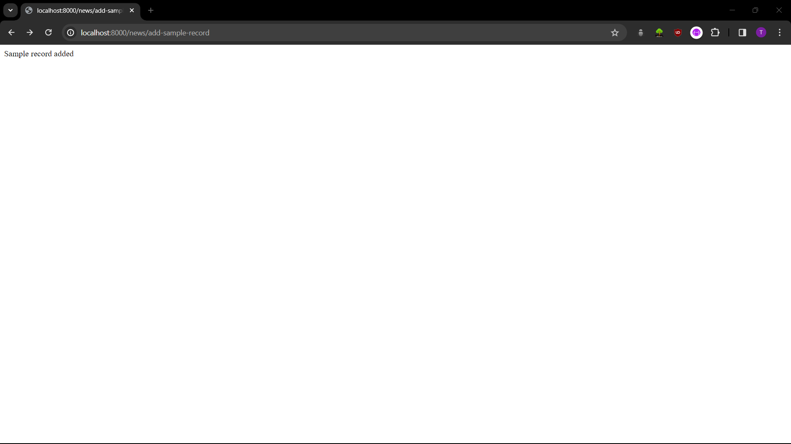

# News Time Machine

A webservice that aggregates news videos from Youtube and provides summaries as well as search based on video content.

## Milestone 1

[Base Repo Structure](https://github.com/nickjj/docker-django-example) 

Additions to Base: 

- Django-Ninja
- Jetstream

## Milestone 2

Added `SQLAlchemy` (`src/news/db.py`) and `Pydantic` (`src/news/model.py`) models to allow database interaction. Added two routes to test `insert` and `select` operations (`add-sample-record`, `get-all-records` in `src/news/views.py`).

### Entity Relationship Diagram

The `id` column is the primary key for the table and is an auto-incrementing `UUID` which is assigned to each new row. The `url` column has a `UNIQUE` constraint on it to identify whether a video is new or has simply been updated. The `transcript` column is of type `text` to store a larger amount of data. The `created_at` and `updated_at` fields can be used to identify when the row was created and whether it has been updated or not as well as when.

## Milestone 3

A list of `50` Youtube videos was compiled in `src/news/videos.csv` with `10` videos for each category (Ukraine War, Stock Market, Interest Rates, Cancer, Electric Vehicles). These videos were then inserted into the `postgres` database by downloading their information using `pytube` and publishing them to `jetstream` in the `protobuf` format. The videos were then consumed from `jetstream` and inserted into the `postgres` database. 

The backend endpoint `/news/download-videos` is used to trigger the `celery` task to download and publish the videos. The endpoint `/news/insert-videos` is used to trigger the `celery` task to insert the data into the database.

The endpoint `/news/get-all-records` retrieves the data from the database and returns it as a formatted `json`. The frontend endpoint `/latest` queries `/news/get-all-records` to get the data and displays it in a table on the frontend (shown below)

## Milestone 4
A new column was added to the table on the `latest` page at `/latest` called `Summary` which contains a link to a summary page. The summary page is at the `/summarize` endpoint and takes one parameter which is the video `id` and uses it to display the `transcript` and `summary` of the video side by side.

The summary is generated using the `OpenAI` model `gpt-3.5-turbo` and then displayed to the user. The summary is stored in the database along with the video to reduce the number of `api` calls made to the model. A new summary is generated if one does not exist yet or if the video information was updated since the last summary was generated which may have modified the transcript. The backend endpoint that handles the summarization logic is `/news/get-summary` which again takes the video `id` as a url parameter.

A new page called `Chat` was also added to the application at the endpoint `/chat`. This page has a user interface that allows the user to ask questions to the model which are answered using the model and the data extracted from the videos.

The data is extracted from the videos by collecting all the transcripts and splitting them using the `RecursiveCharacterTextSplitter` from `langchain`. This splits the data into chunks of `1000` characters with an overlap of `200` characters between chunks. The chunks are then vectorized and stored in a vector database using `Chroma`, also from `langchain`. This extraction is handled by the backend endpoint `/news/vectorize-data`.

The chat interface takes the user's question and sends it to the backend endpoint `/news/search` which handles the logic. First, the backend function loads the vector data from `Chroma` and performs a similarity search using the user's question to retrieve `6` of the most relevant chunks of data. The data chunks are then formatted into a `context` that is used by the model. The context and the user's question are formatted as a part of a prompt that instructs the model to answer the question based on the context provided and the model's response is sent to the frontend where it is displayed to the user.

## Milestone 5
The UI improvements made for this milestone are the addition of the `summary` column to the `latest` page and the corresponding summary page and the chat interface. The summary page consists of two columns of data which show the user the original transcript on the left and the generated summmary on the right.

The chat page consists of a input box at the bottom where the user can ask their questions which are then displayed in the chat interface above the input along with the response in a manner similar to text messages on a mobile phone.

Chat responses for the following questions: 
- What are the most recent news about the war in Ukraine?

- What are the chances for the US Fed to reduce interest rates in 2024?

- Did the stock market fall after the latest jobs report?

- Why are prices of electric vehicles falling?

- What are the latest developments in the fight against cancer?

